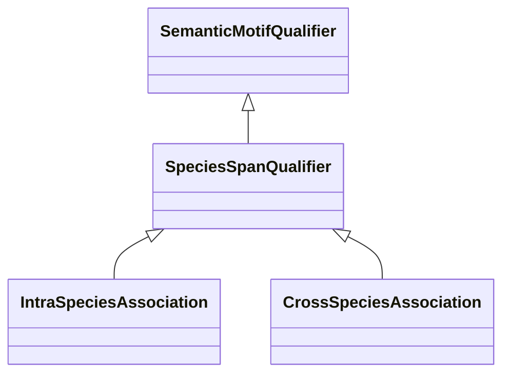

# Class: Species Coverage (SpeciesSpanQualifier) 


_A qualifier of this type tells if the category is about the same species of the gene that starts _

_a semantic motif paths or if it involves multiple species._

__


* __NOTE__: this is an abstract class and should not be instantiated directly


URI: [motif:SpeciesSpanQualifier](https://knetminer.com/terms/motifs/motif-categories/SpeciesSpanQualifier)





## Inheritance
* [SemanticMotifQualifier](SemanticMotifQualifier.md)
    * **SpeciesSpanQualifier**
        * [IntraSpeciesAssociation](IntraSpeciesAssociation.md)
        * [CrossSpeciesAssociation](CrossSpeciesAssociation.md)


## Slots

| Name | Cardinality and Range | Description | Inheritance |
| ---  | --- | --- | --- |


## Mixin Usage

| mixed into | description |
| --- | --- |


## Identifier and Mapping Information


### Schema Source


* from schema: https://knetminer.com/terms/motifs/motif-categories/schema


## Mappings

| Mapping Type | Mapped Value |
| ---  | ---  |
| self | motif:SpeciesSpanQualifier |
| native | motif:SpeciesSpanQualifier |


## LinkML Source

<!-- TODO: investigate https://stackoverflow.com/questions/37606292/how-to-create-tabbed-code-blocks-in-mkdocs-or-sphinx -->

### Direct

<details>
```yaml
name: SpeciesSpanQualifier
description: "A qualifier of this type tells if the category is about the same species\
  \ of the gene that starts \na semantic motif paths or if it involves multiple species.\n"
title: Species Coverage
from_schema: https://knetminer.com/terms/motifs/motif-categories/schema
is_a: SemanticMotifQualifier
abstract: true
mixin: true

```
</details>

### Induced

<details>
```yaml
name: SpeciesSpanQualifier
description: "A qualifier of this type tells if the category is about the same species\
  \ of the gene that starts \na semantic motif paths or if it involves multiple species.\n"
title: Species Coverage
from_schema: https://knetminer.com/terms/motifs/motif-categories/schema
is_a: SemanticMotifQualifier
abstract: true
mixin: true

```
</details>