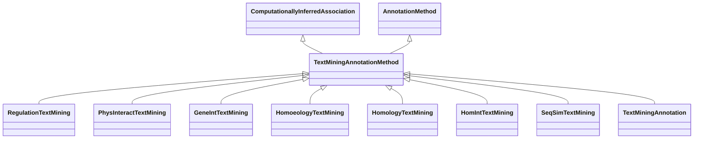

# Class: Text Mining Annotation Method (TextMiningAnnotationMethod) 


_An association that was computed via text mining methods, such as name-entity recognition,_

_semantic similarity or LLM-based embeddings._

__

_Note that this is the abstract category used to derive concrete/instantiantable categories_

_that imply the use of this annotation method. Use `TextMiningAnnotation` to associate a _

_semantic motif to a text mining annotation._

__


* __NOTE__: this is an abstract class and should not be instantiated directly


URI: [motif:TextMiningAnnotationMethod](https://knetminer.com/terms/motifs/motif-categories/TextMiningAnnotationMethod)





## Inheritance
* [SemanticMotifCategory](SemanticMotifCategory.md)
    * [AnnotationMethod](AnnotationMethod.md)
        * **TextMiningAnnotationMethod** [ [ComputationallyInferredAssociation](ComputationallyInferredAssociation.md)]


## Slots

| Name | Cardinality and Range | Description | Inheritance |
| ---  | --- | --- | --- |


## Mixin Usage

| mixed into | description |
| --- | --- |
| [RegulationTextMining](RegulationTextMining.md) | An association that represents a text mining annotation based on gene express... |
| [PhysInteractTextMining](PhysInteractTextMining.md) | An association that represents a text mining annotation based on physical int... |
| [GeneIntTextMining](GeneIntTextMining.md) | An association that represents a text mining annotation based on gene-gene in... |
| [HomoeologyTextMining](HomoeologyTextMining.md) | An association that represents a text mining annotation based on homoeology |
| [HomologyTextMining](HomologyTextMining.md) | An association that represents a text mining annotation based on homology |
| [HomIntTextMining](HomIntTextMining.md) | An association that represents a text mining annotation based on homology and... |
| [SeqSimTextMining](SeqSimTextMining.md) | An association that represents a text mining annotation based on sequence sim... |
| [TextMiningAnnotation](TextMiningAnnotation.md) | An association that was computed via text mining methods, such as name-entity... |


## Identifier and Mapping Information


### Schema Source


* from schema: https://knetminer.com/terms/motifs/motif-categories/schema


## Mappings

| Mapping Type | Mapped Value |
| ---  | ---  |
| self | motif:TextMiningAnnotationMethod |
| native | motif:TextMiningAnnotationMethod |


## LinkML Source

<!-- TODO: investigate https://stackoverflow.com/questions/37606292/how-to-create-tabbed-code-blocks-in-mkdocs-or-sphinx -->

### Direct

<details>
```yaml
name: TextMiningAnnotationMethod
description: "An association that was computed via text mining methods, such as name-entity\
  \ recognition,\nsemantic similarity or LLM-based embeddings.\n\nNote that this is\
  \ the abstract category used to derive concrete/instantiantable categories\nthat\
  \ imply the use of this annotation method. Use `TextMiningAnnotation` to associate\
  \ a \nsemantic motif to a text mining annotation.\n"
title: Text Mining Annotation Method
from_schema: https://knetminer.com/terms/motifs/motif-categories/schema
is_a: AnnotationMethod
abstract: true
mixin: true
mixins:
- ComputationallyInferredAssociation

```
</details>

### Induced

<details>
```yaml
name: TextMiningAnnotationMethod
description: "An association that was computed via text mining methods, such as name-entity\
  \ recognition,\nsemantic similarity or LLM-based embeddings.\n\nNote that this is\
  \ the abstract category used to derive concrete/instantiantable categories\nthat\
  \ imply the use of this annotation method. Use `TextMiningAnnotation` to associate\
  \ a \nsemantic motif to a text mining annotation.\n"
title: Text Mining Annotation Method
from_schema: https://knetminer.com/terms/motifs/motif-categories/schema
is_a: AnnotationMethod
abstract: true
mixin: true
mixins:
- ComputationallyInferredAssociation

```
</details>